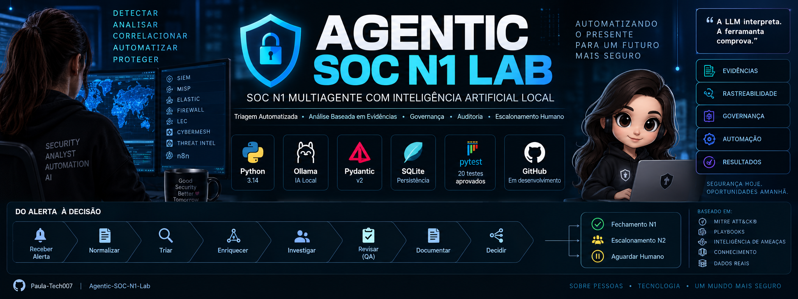
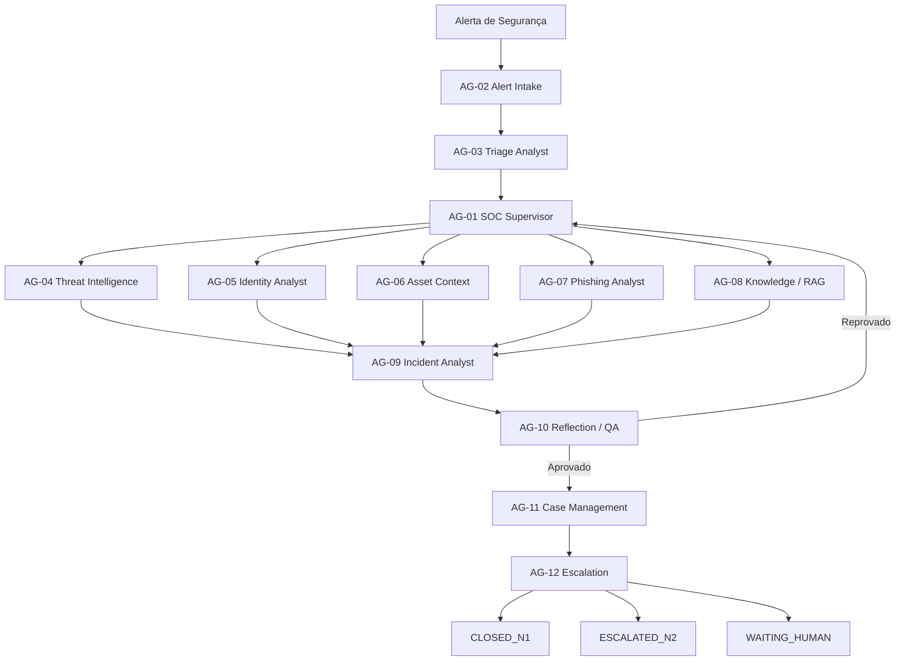

<div align="center">



# 🛡️ Agentic SOC N1 Lab

### SOC N1 Multiagente com Inteligência Artificial Local

**Triagem Automatizada • Análise Baseada em Evidências • Governança • Auditoria • Escalonamento Humano**

[](https://www.python.org/)
[](https://ollama.com/)
[](https://docs.pydantic.dev/)
[](https://www.sqlite.org/)
[](https://pytest.org/)


</div>

---

## 📌 Sobre o Projeto

O **Agentic SOC N1 Lab** é um laboratório de engenharia de segurança voltado à construção de uma arquitetura **multiagente para automação de operações de SOC N1**.

O projeto combina agentes especializados, IA local, ferramentas defensivas, evidências, governança, auditoria e regras determinísticas para investigar alertas de segurança de forma controlada.

A arquitetura segue um princípio central:

> **A LLM interpreta. A ferramenta comprova.**

Nenhuma conclusão crítica deve depender somente da resposta de um modelo de linguagem.

O sistema deve utilizar ferramentas autorizadas, evidências verificáveis, regras de governança e possibilidade de escalonamento humano.

---

## 🎯 Objetivo

O objetivo é automatizar atividades repetitivas normalmente executadas pelo SOC N1, permitindo que analistas humanos concentrem seus esforços em tarefas de maior complexidade.

O sistema deverá ser capaz de:

- receber alertas;
- normalizar eventos;
- realizar triagem;
- enriquecer indicadores;
- consultar Threat Intelligence;
- analisar identidades;
- analisar ativos;
- investigar phishing;
- consultar conhecimento via RAG;
- consolidar evidências;
- construir uma investigação;
- revisar a qualidade da análise;
- documentar o caso;
- decidir fechamento ou escalonamento;
- registrar todas as etapas em auditoria.

---

## 🧠 Arquitetura Multiagente

O projeto possui **12 agentes especializados**.

| ID | Agente | Responsabilidade |
|---|---|---|
| **AG-01** | SOC Supervisor Agent | Coordena o fluxo completo da investigação |
| **AG-02** | Alert Intake Agent | Recebe, valida e normaliza alertas |
| **AG-03** | Triage Analyst Agent | Realiza triagem, classificação e severidade |
| **AG-04** | Threat Intelligence Agent | Enriquece indicadores utilizando fontes autorizadas |
| **AG-05** | Identity Analyst Agent | Analisa contas, autenticação, MFA e privilégios |
| **AG-06** | Asset Context Agent | Analisa ativos, criticidade e contexto |
| **AG-07** | Phishing Analyst Agent | Realiza análise especializada de phishing |
| **AG-08** | Knowledge / RAG Agent | Recupera playbooks, políticas, runbooks e conhecimento |
| **AG-09** | Incident Analyst Agent | Consolida evidências e investigação |
| **AG-10** | Reflection / QA Agent | Revisa evidências, inconsistências e qualidade |
| **AG-11** | Case Management Agent | Mantém documentação e registros do caso |
| **AG-12** | Escalation Agent | Aplica regras de fechamento e escalonamento |

---

## 🏗️ Arquitetura Geral



O **SOC Supervisor Agent** decide quais especialistas precisam participar de cada investigação.

Nem todos os agentes precisam ser executados em todos os casos.

---

## 🔄 Ciclo de Vida do Caso

Estados principais:

```text
RECEIVED
   ↓
NORMALIZING
   ↓
TRIAGING
   ↓
ENRICHING
   ↓
INVESTIGATING
   ↓
CORRELATING
   ↓
REVIEWING
   ↓
DOCUMENTING
   ↓
DECIDING
   ↓
CLOSED_N1 / ESCALATED_N2
```

Estados auxiliares:

```text
WAITING_DATA
WAITING_HUMAN
RETRYING
FAILED
CANCELLED
```

Estados dos agentes:

```text
PENDING
RUNNING
COMPLETED
FAILED
SKIPPED
```

---

## 🧩 CaseState

O `CaseState` funciona como a **ficha viva do incidente**.

Ele concentra as informações produzidas durante toda a investigação.

```text
Alert
+
IOC
+
Identity
+
Asset
+
Evidence
+
Triage
+
Threat Intelligence
+
Phishing
+
Knowledge / RAG
+
Investigation
+
QA
+
Escalation
+
Audit
+
Workflow
=
CaseState
```

Atualmente o `CaseState` possui suporte a:

- validação de `correlation_id`;
- controle de versão;
- timestamps;
- IOCs;
- identidades;
- ativos;
- evidências;
- phishing;
- conhecimento/RAG;
- investigação;
- QA;
- escalonamento;
- workflow;
- auditoria;
- prevenção de evidência duplicada;
- prevenção de auditoria duplicada;
- serialização JSON;
- persistência SQLite.

---

## 🔐 Imutabilidade

A arquitetura protege informações que não devem ser alteradas silenciosamente durante uma investigação.

### `raw_event`

O evento bruto recebido pelo sistema é convertido para uma estrutura imutável.

```text
Evento recebido
      ↓
FrozenDict
      ↓
raw_event imutável
```

Isso ajuda a preservar o conteúdo original que iniciou a investigação.

### Evidências

As evidências são registros imutáveis.

Depois que uma evidência é criada, seu conteúdo não pode ser modificado silenciosamente.

### Auditoria

Os eventos de auditoria também são imutáveis.

O próprio objeto e seu `payload` interno ficam protegidos contra alteração posterior.

---

## 🔍 Modelo de Evidências

Toda conclusão deve possuir rastreabilidade.

Exemplos de fontes de evidência:

- alertas;
- IOCs;
- Threat Intelligence;
- identidade;
- ativos;
- e-mail;
- logs;
- ferramentas;
- conhecimento;
- análise de incidente.

Fluxo conceitual:

```text
Informação observada
        ↓
     Evidência
        ↓
      Achado
        ↓
   Investigação
        ↓
  Reflection / QA
        ↓
      Decisão
```

---

## 📧 Análise de Phishing

A Fase 2 inclui um schema específico para o futuro:

```text
AG-07 Phishing Analyst Agent
```

O resultado estruturado permite registrar:

- remetente;
- destinatários;
- assunto;
- URLs;
- anexos;
- hashes;
- SPF;
- DKIM;
- DMARC;
- indicadores suspeitos;
- evidências;
- classificação;
- severidade;
- confiança;
- resumo da análise.

---

## 📚 Knowledge / RAG

O projeto também possui contrato estruturado para o:

```text
AG-08 Knowledge / RAG Agent
```

A arquitetura exige que informações recuperadas tenham origem conhecida.

Cada trecho recuperado registra:

```text
chunk_id
document_name
document_type
section
content
similarity_score
source_path
metadata
```

Fluxo esperado:

```text
Consulta
   ↓
Busca semântica
   ↓
Trecho recuperado
   ↓
Documento + seção + score
   ↓
KnowledgeResult
```

Uma resposta de conhecimento não deve existir sem fonte recuperada.

---

## 🧾 Auditoria

A arquitetura possui `AuditEvent` para registrar acontecimentos importantes.

Exemplos:

```text
CASE_CREATED
CASE_UPDATED
AGENT_STARTED
AGENT_COMPLETED
TOOL_CALLED
EVIDENCE_ADDED
QA_REVIEWED
DECISION_CREATED
ERROR
HUMAN_ACTION
```

Cada evento pode registrar:

- `audit_id`;
- `case_id`;
- `correlation_id`;
- tipo de evento;
- tipo de ator;
- identificador do ator;
- ação;
- status;
- mensagem;
- referências;
- payload;
- timestamp.

### Append-only

A auditoria segue filosofia **append-only**.

```text
Evento 1
   ↓
Evento 2
   ↓
Evento 3
   ↓
Evento 4
```

Eventos anteriores não são sobrescritos.

IDs duplicados são rejeitados no `CaseState`.

---

## 💾 Persistência

O projeto possui dois mecanismos principais de persistência.

### JSON

Um `CaseState` completo pode ser serializado e restaurado:

```text
CaseState
   ↓
JSON
   ↓
CaseState
```

Arquivos operacionais ficam em:

```text
storage/incidents/
```

Esses arquivos não são versionados pelo Git.

---

### SQLite

O banco padrão é:

```text
storage/database/agentic_soc.db
```

A persistência atualmente inclui:

```text
cases
audit_events
```

A tabela `cases` mantém o estado atual do incidente.

A tabela `audit_events` mantém o histórico append-only da auditoria.

O banco também utiliza índices para facilitar consultas por:

- `correlation_id`;
- `alert_id`;
- status;
- `case_id`;
- tipo de evento;
- timestamp.

Arquivos SQLite operacionais são ignorados pelo Git.

---

## 🤖 Inteligência Artificial Local

O laboratório utiliza **Ollama** para execução local dos modelos.

| Função | Modelo |
|---|---|
| LLM / raciocínio dos agentes | `qwen3:4b-instruct` |
| Embeddings / RAG | `embeddinggemma` |

A execução local permite desenvolver e testar o núcleo da arquitetura sem depender obrigatoriamente de APIs externas.

---

## ⚙️ Tecnologias

| Tecnologia | Utilização |
|---|---|
| Python 3.14 | Desenvolvimento principal |
| Pydantic v2 | Schemas e validação |
| Ollama | Execução local de modelos |
| Qwen3 | LLM |
| EmbeddingGemma | Embeddings |
| SQLite | Persistência |
| Pytest | Testes automatizados |
| Git | Controle de versão |
| GitHub | Versionamento |
| Mermaid | Diagramas |

Integrações futuras incluem:

- MISP;
- Elastic;
- Grafana;
- APIs de segurança;
- RAG;
- MCP;
- ferramentas SOC.

---

## 🧪 Testes Automatizados

O projeto possui atualmente:

```text
28 testes automatizados aprovados
```

Distribuição atual:

```text
8  testes de fundação
20 testes da Fase 2
-------------------
28 testes totais
```

Os testes validam:

- schemas;
- enums;
- limites de confiança;
- rejeição de campos desconhecidos;
- imutabilidade de evidências;
- imutabilidade de `raw_event`;
- imutabilidade de auditoria;
- imutabilidade do payload da auditoria;
- criação de PhishingResult;
- Knowledge/RAG com fonte obrigatória;
- consistência de `correlation_id`;
- versionamento do CaseState;
- prevenção de evidência duplicada;
- prevenção de auditoria duplicada;
- serialização JSON;
- desserialização JSON;
- workflow dos agentes;
- QA e retry;
- escalonamento;
- persistência SQLite;
- persistência SQLite de auditoria;
- prevenção de duplicação de auditoria no banco.

Executar os testes:

```bash
python -m pytest -q
```

Resultado atual esperado:

```text
28 passed
```

---

## 🛡️ Segurança e Governança

Princípios fundamentais:

- **Deny by default**
- **Least privilege**
- **Evidência antes da conclusão**
- **Dados de ferramentas acima de suposições da LLM**
- **raw_event imutável**
- **Evidências imutáveis**
- **Auditoria imutável**
- **Auditoria append-only**
- **Execução limitada**
- **Fail closed**
- **Escalonamento humano**
- **Sem shell irrestrito**
- **Sem contenção crítica autônoma**

Uma resposta de LLM sozinha nunca deve ser considerada prova de comprometimento.

---

## ⛔ Restrições de Ações Autônomas

O MVP não executa automaticamente ações críticas como:

```text
Troca de senha
Desativação de conta
Alteração de firewall
Bloqueio de IP
Isolamento de endpoint
Contenção em produção
```

Essas ações podem ser representadas como:

```text
RECOMMENDED_ACTION
```

ou:

```text
SIMULATED_ACTION
```

A execução real depende de autorização humana e política organizacional.

---

## 🚨 Decisão N1 / N2

O fechamento automático pelo N1 é conservador.

Critérios previstos incluem:

- confiança mínima elevada;
- QA aprovado;
- evidências suficientes;
- playbook concluído;
- ausência de comprometimento confirmado;
- ausência de regra obrigatória de escalonamento.

Situações que podem exigir N2:

- conta privilegiada;
- ativo crítico;
- IOC malicioso confirmado;
- movimentação lateral;
- exfiltração;
- comprometimento confirmado;
- alerta não suportado;
- falha de QA após limite de retries.

As **hard rules** possuem prioridade sobre interpretação da LLM.

---

## 📋 Tipos de Alertas Iniciais

```text
AUTH_BRUTE_FORCE
SUSPICIOUS_LOGIN
CREDENTIAL_EXPOSURE
PHISHING
MALWARE_DETECTION
SUSPICIOUS_POWERSHELL
MALICIOUS_IOC
PRIVILEGED_ACCOUNT_ACTIVITY
LATERAL_MOVEMENT_SUSPECTED
DATA_EXFILTRATION_SUSPECTED
```

Alertas não suportados devem ser escalados em vez de interpretados livremente.

---

## 📂 Estrutura do Projeto

```text
Agentic-SOC-N1-Lab/
│
├── agents/
│   ├── supervisor/
│   ├── alert_intake/
│   ├── triage/
│   ├── threat_intel/
│   ├── identity/
│   ├── asset/
│   ├── phishing/
│   ├── knowledge/
│   ├── incident/
│   ├── reflection/
│   ├── case_management/
│   └── escalation/
│
├── assets/
│   └── banner-agentic-soc-n1-lab.png
│
├── core/
│   ├── config/
│   ├── llm/
│   ├── orchestrator/
│   ├── permissions/
│   ├── schemas/
│   │   ├── alert.py
│   │   ├── asset.py
│   │   ├── audit.py
│   │   ├── enums.py
│   │   ├── escalation.py
│   │   ├── evidence.py
│   │   ├── identity.py
│   │   ├── immutable.py
│   │   ├── investigation.py
│   │   ├── ioc.py
│   │   ├── knowledge.py
│   │   ├── phishing.py
│   │   ├── qa.py
│   │   ├── threat_intel.py
│   │   ├── triage.py
│   │   └── workflow.py
│   │
│   └── state/
│       ├── case_state.py
│       ├── database.py
│       └── serialization.py
│
├── docs/
│   ├── ARCHITECTURE.md
│   └── SCOPE.md
│
├── knowledge/
│   ├── mitre/
│   ├── playbooks/
│   ├── policies/
│   └── runbooks/
│
├── mcp/
│   ├── client/
│   └── server/
│
├── rag/
│   ├── embeddings/
│   ├── index/
│   ├── ingestion/
│   └── retrieval/
│
├── simulations/
│
├── storage/
│   ├── audit/
│   ├── database/
│   └── incidents/
│
├── tests/
│   ├── test_foundation.py
│   └── test_phase2.py
│
├── tools/
│
├── main.py
├── requirements.txt
└── README.md
```

---

## 🗺️ Roadmap

| Fase | Escopo | Status |
|---|---|---|
| **Fase 0** | Escopo, arquitetura, governança e definição dos agentes | ✅ Concluída |
| **Fase 1** | Fundação técnica, IA local e estrutura do projeto | ✅ Concluída |
| **Fase 2** | Schemas, CaseState, imutabilidade, auditoria, persistência e testes | ✅ Concluída |
| **Fase 3** | Runtime dos agentes e orquestração | ⏳ Planejada |
| **Fase 4** | Ferramentas e integrações de segurança | ⏳ Planejada |
| **Fase 5** | RAG e camada de conhecimento | ⏳ Planejada |
| **Fase 6** | MCP | ⏳ Planejada |
| **Fase 7** | Execução SOC multiagente ponta a ponta | ⏳ Planejada |

Todas as fases representam **evoluções deste mesmo projeto e deste mesmo repositório**.

---

## 🧭 Filosofia da Arquitetura

```text
LLM
│
├── interpreta contexto
├── resume informações
├── analisa evidências
└── propõe conclusões


FERRAMENTAS
│
├── consultam sistemas
├── recuperam informações
├── validam fatos
└── produzem evidências


GOVERNANÇA
│
├── controla permissões
├── aplica hard rules
├── registra auditoria
├── revisa decisões
└── determina escalonamento
```

A separação entre interpretação, comprovação e governança é fundamental para o projeto.

---

## 🚀 Executando o Projeto

### Criar ambiente virtual

```bash
python -m venv .venv
```

### Ativar no Windows PowerShell

```powershell
.\.venv\Scripts\Activate.ps1
```

### Instalar dependências

```bash
pip install -r requirements.txt
```

### Executar aplicação base

```bash
python main.py
```

### Executar todos os testes

```bash
python -m pytest -q
```

Resultado atual:

```text
28 passed
```

---

## ⚠️ Uso Defensivo

Este projeto é destinado a:

- pesquisa defensiva em segurança;
- laboratórios SOC;
- estudos de automação;
- arquitetura de agentes de IA;
- engenharia de segurança;
- simulações controladas.

O objetivo não é fornecer capacidade ofensiva autônoma.

---

## 👩‍💻 Autora

**Paula Sabino**

Segurança Cibernética • Automação de Segurança • IA Agêntica • SOC

GitHub: [@Paula-Tech007](https://github.com/Paula-Tech007)

---

<div align="center">

### 🛡️ Agentic SOC N1 Lab

**Construindo um SOC multiagente auditável, governado e orientado por evidências.**

</div>