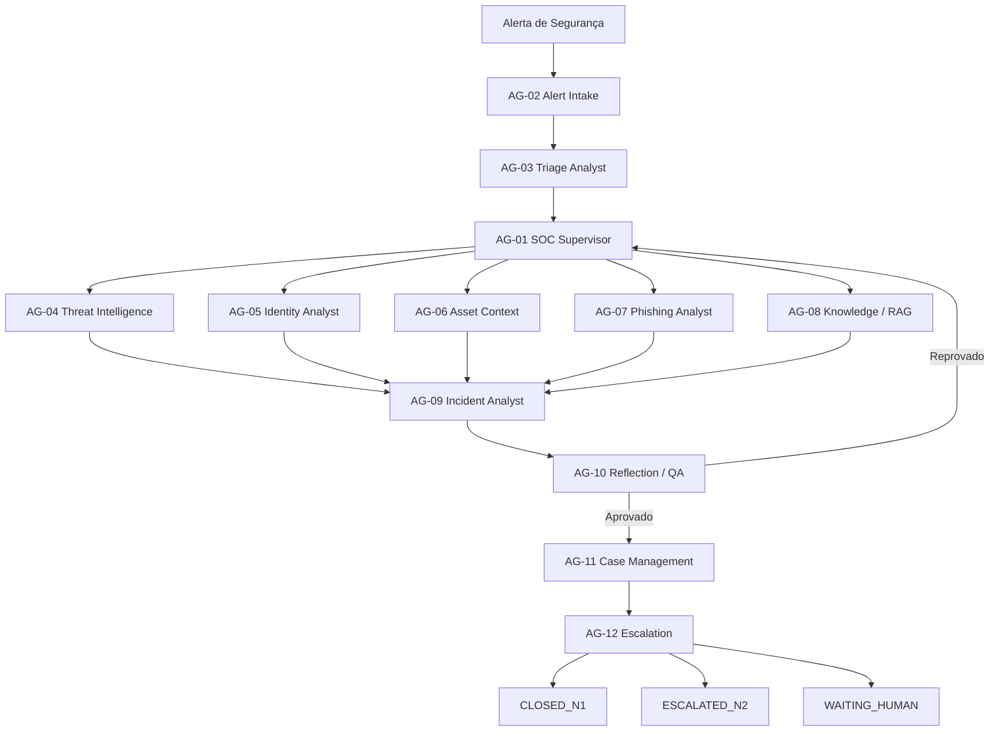

<div align="center">
  
</div>

<br>

<div align="center">

# 🛡️ Agentic SOC N1 Lab

### SOC N1 Multiagente com Inteligência Artificial Local

**Triagem Automatizada • Análise Baseada em Evidências • Governança • Auditoria • Escalonamento Humano**

[](https://www.python.org/)
[](https://ollama.com/)
[](https://docs.pydantic.dev/)
[](https://www.sqlite.org/)
[](https://pytest.org/)


</div>

---

## 📌 Sobre o Projeto

O **Agentic SOC N1 Lab** é um projeto de engenharia de segurança voltado à construção de uma arquitetura **multiagente para automação de operações de SOC N1**.

A proposta é criar agentes especializados capazes de colaborar durante o ciclo de análise de um alerta de segurança, mantendo:

- rastreabilidade;
- evidências;
- governança;
- auditoria;
- controle de permissões;
- revisão de qualidade;
- escalonamento para N2;
- possibilidade de intervenção humana.

O projeto segue um princípio central:

> **A LLM interpreta. A ferramenta comprova.**

O modelo de linguagem pode auxiliar na interpretação do contexto, porém nenhuma conclusão crítica deve depender apenas da resposta da IA.

---

## 🎯 Objetivo

O objetivo principal é automatizar atividades repetitivas normalmente executadas pelo SOC N1, permitindo que os analistas humanos atuem em tarefas de maior complexidade.

O sistema deverá ser capaz de:

- receber alertas;
- normalizar eventos;
- realizar triagem;
- identificar contexto;
- enriquecer IOCs;
- consultar identidade;
- consultar ativos;
- buscar conhecimento;
- montar uma investigação;
- revisar a investigação;
- documentar o caso;
- decidir fechamento ou escalonamento.

Tudo isso com controle e rastreabilidade.

---

## 🧠 Arquitetura Multiagente

O projeto possui atualmente **12 agentes especializados**.

| ID | Agente | Responsabilidade |
|---|---|---|
| **AG-01** | SOC Supervisor Agent | Coordena todo o fluxo da investigação |
| **AG-02** | Alert Intake Agent | Recebe, valida e normaliza alertas |
| **AG-03** | Triage Analyst Agent | Realiza triagem, classificação e severidade inicial |
| **AG-04** | Threat Intelligence Agent | Enriquece indicadores e consulta fontes de inteligência |
| **AG-05** | Identity Analyst Agent | Analisa contas, usuários, MFA e autenticação |
| **AG-06** | Asset Context Agent | Analisa ativos, criticidade e contexto de infraestrutura |
| **AG-07** | Phishing Analyst Agent | Realiza análise especializada de phishing |
| **AG-08** | Knowledge / RAG Agent | Consulta playbooks, políticas, runbooks e conhecimento |
| **AG-09** | Incident Analyst Agent | Consolida evidências e produz a investigação |
| **AG-10** | Reflection / QA Agent | Revisa evidências, inconsistências e qualidade |
| **AG-11** | Case Management Agent | Mantém documentação e registros do caso |
| **AG-12** | Escalation Agent | Decide fechamento, escalonamento ou espera humana |

---

## 🏗️ Arquitetura Geral



O **SOC Supervisor Agent** coordena os agentes necessários para cada tipo de incidente.

Nem todos os agentes precisam trabalhar em todos os casos.

---

## 🔄 Ciclo de Vida do Caso

Estados principais:

```text
RECEIVED
   ↓
NORMALIZING
   ↓
TRIAGING
   ↓
ENRICHING
   ↓
INVESTIGATING
   ↓
CORRELATING
   ↓
REVIEWING
   ↓
DOCUMENTING
   ↓
DECIDING
   ↓
CLOSED_N1 / ESCALATED_N2
```

Estados auxiliares:

```text
WAITING_DATA
WAITING_HUMAN
RETRYING
FAILED
CANCELLED
```

Estados dos agentes:

```text
PENDING
RUNNING
COMPLETED
FAILED
SKIPPED
```

---

## 🧩 CaseState

O `CaseState` representa a **ficha viva do incidente**.

Ele centraliza as informações produzidas pelos agentes durante a investigação.

```text
Alert
+
IOC
+
Identity
+
Asset
+
Evidence
+
Triage
+
Threat Intelligence
+
Investigation
+
QA
+
Escalation
+
Workflow
=
CaseState
```

Atualmente o `CaseState` possui suporte a:

- validação de correlação;
- controle de versão;
- timestamps;
- evidências;
- estado do workflow;
- proteção contra evidência duplicada;
- serialização JSON;
- desserialização;
- persistência SQLite.

---

## 🔍 Modelo de Evidências

As evidências são uma das partes mais importantes da arquitetura.

Toda conclusão deve possuir rastreabilidade.

Exemplos:

- alerta;
- IOC;
- consulta de Threat Intelligence;
- dados de identidade;
- informações de ativos;
- logs;
- retorno de ferramentas;
- resultados de consultas;
- conhecimento recuperado;
- análise do incidente.

Fluxo:

```text
Informação observada
        ↓
     Evidência
        ↓
      Achado
        ↓
   Investigação
        ↓
  Reflection / QA
        ↓
      Decisão
```

As evidências são tratadas como registros imutáveis.

Uma evidência criada não deve ser silenciosamente alterada.

---

## 🧪 Testes Automatizados

O projeto possui atualmente:

```text
20 testes automatizados aprovados
```

Os testes verificam cenários positivos e negativos.

Entre eles:

- criação de alertas;
- validação de schemas;
- rejeição de confidence acima de 100;
- imutabilidade de evidências;
- consistência de `correlation_id`;
- prevenção de evidência duplicada;
- versionamento do `CaseState`;
- serialização JSON;
- desserialização JSON;
- workflow dos agentes;
- retry de QA;
- escalonamento;
- persistência SQLite;
- rejeição de campos não previstos.

Para executar todos os testes:

```bash
python -m pytest -q
```

Resultado atual:

```text
20 passed
```

---

## 💾 Persistência

O projeto possui atualmente dois mecanismos de persistência.

### JSON

Um `CaseState` completo pode ser transformado em JSON:

```text
CaseState
   ↓
JSON
   ↓
CaseState
```

Os incidentes armazenados em JSON ficam em:

```text
storage/incidents/
```

---

### SQLite

Também existe persistência utilizando SQLite.

Banco padrão:

```text
storage/database/agentic_soc.db
```

O banco armazena informações como:

- `case_id`;
- `correlation_id`;
- `alert_id`;
- status do caso;
- decisão final;
- versão;
- timestamps;
- JSON completo do `CaseState`.

Os arquivos operacionais não são versionados no Git.

---

## 🤖 Inteligência Artificial Local

O laboratório utiliza atualmente o **Ollama** para execução local dos modelos.

| Função | Modelo |
|---|---|
| LLM / raciocínio dos agentes | `qwen3:4b-instruct` |
| Embeddings / RAG | `embeddinggemma` |

A utilização de modelos locais permite desenvolver e testar a arquitetura sem depender obrigatoriamente de APIs externas para o núcleo do laboratório.

---

## ⚙️ Tecnologias

| Tecnologia | Utilização |
|---|---|
| Python 3.14 | Desenvolvimento principal |
| Pydantic v2 | Schemas e validação |
| Ollama | Execução local de modelos |
| Qwen3 | LLM |
| EmbeddingGemma | Embeddings |
| SQLite | Persistência |
| Pytest | Testes automatizados |
| Git | Controle de versão |
| GitHub | Versionamento do projeto |
| Mermaid | Diagramas de arquitetura |

Integrações futuras incluem:

- RAG;
- MCP;
- MISP;
- Elastic;
- APIs de segurança;
- ferramentas SOC;
- automação e orquestração.

---

## 🛡️ Segurança e Governança

A arquitetura segue princípios defensivos.

### Regras principais

- **Deny by default**
- **Least privilege**
- **Evidência antes da conclusão**
- **Dados de ferramentas acima de suposições da LLM**
- **Evidências imutáveis**
- **Auditoria**
- **Execução limitada**
- **Fail closed**
- **Escalonamento humano disponível**
- **Sem shell irrestrito**
- **Sem contenção crítica autônoma**

Uma resposta de LLM sozinha nunca deve ser considerada prova de comprometimento.

---

## ⛔ Restrições de Ações Autônomas

O MVP atual não executa automaticamente ações críticas como:

```text
Troca de senha
Desativação de conta
Alteração de firewall
Bloqueio de IP
Isolamento de endpoint
Contenção em produção
```

Essas ações podem ser representadas como:

```text
RECOMMENDED_ACTION
```

ou:

```text
SIMULATED_ACTION
```

A execução real depende de autorização e política organizacional.

---

## 🚨 Decisão N1 / N2

O fechamento automático pelo N1 deve ser conservador.

Exemplo de critérios:

- confiança elevada;
- QA aprovado;
- evidências suficientes;
- playbook concluído;
- ausência de comprometimento confirmado;
- ausência de regra obrigatória de escalonamento.

Situações que podem exigir escalonamento:

- conta privilegiada;
- ativo crítico;
- IOC malicioso confirmado;
- movimentação lateral;
- possível exfiltração;
- comprometimento confirmado;
- tipo de alerta não suportado;
- falha do QA após limite de retries.

As **hard rules** possuem prioridade sobre a interpretação da LLM.

---

## 📋 Tipos de Alertas Iniciais

Atualmente previstos:

```text
AUTH_BRUTE_FORCE
SUSPICIOUS_LOGIN
CREDENTIAL_EXPOSURE
PHISHING
MALWARE_DETECTION
SUSPICIOUS_POWERSHELL
MALICIOUS_IOC
PRIVILEGED_ACCOUNT_ACTIVITY
LATERAL_MOVEMENT_SUSPECTED
DATA_EXFILTRATION_SUSPECTED
```

Tipos não suportados devem ser escalados em vez de serem interpretados livremente.

---

## 📂 Estrutura do Projeto

```text
Agentic-SOC-N1-Lab/
│
├── agents/
│   ├── supervisor/
│   ├── alert_intake/
│   ├── triage/
│   ├── threat_intel/
│   ├── identity/
│   ├── asset/
│   ├── phishing/
│   ├── knowledge/
│   ├── incident/
│   ├── reflection/
│   ├── case_management/
│   └── escalation/
│
├── core/
│   ├── config/
│   ├── llm/
│   ├── orchestrator/
│   ├── permissions/
│   ├── schemas/
│   └── state/
│
├── docs/
│   ├── ARCHITECTURE.md
│   └── SCOPE.md
│
├── knowledge/
│   ├── mitre/
│   ├── playbooks/
│   ├── policies/
│   └── runbooks/
│
├── mcp/
│   ├── client/
│   └── server/
│
├── rag/
│   ├── embeddings/
│   ├── index/
│   ├── ingestion/
│   └── retrieval/
│
├── simulations/
│
├── storage/
│   ├── audit/
│   ├── database/
│   └── incidents/
│
├── tests/
│   ├── test_foundation.py
│   └── test_phase2.py
│
├── tools/
│
├── main.py
├── requirements.txt
└── README.md
```

---

## 🗺️ Roadmap

| Fase | Escopo | Status |
|---|---|---|
| **Fase 0** | Arquitetura, governança e definição dos agentes | ✅ Concluída |
| **Fase 1** | Fundação do projeto, IA local e configuração | ✅ Concluída |
| **Fase 2** | Schemas, CaseState, persistência e testes | ✅ Concluída |
| **Fase 3** | Runtime dos agentes e orquestração | ⏳ Planejada |
| **Fase 4** | Ferramentas e integrações de segurança | ⏳ Planejada |
| **Fase 5** | RAG e camada de conhecimento | ⏳ Planejada |
| **Fase 6** | Integração MCP | ⏳ Planejada |
| **Fase 7** | Execução SOC multiagente ponta a ponta | ⏳ Planejada |

Todas as fases representam **evoluções deste mesmo projeto e deste mesmo repositório**.

---

## 🧭 Filosofia da Arquitetura

O projeto separa claramente três responsabilidades.

```text
LLM
│
├── interpreta contexto
├── resume informações
├── analisa evidências
└── propõe conclusões


FERRAMENTAS
│
├── consultam sistemas
├── buscam informações
├── validam fatos
└── produzem evidências


GOVERNANÇA
│
├── controla permissões
├── aplica hard rules
├── revisa decisões
└── determina escalonamento
```

Essa separação é fundamental para a arquitetura.

---

## 🚀 Executando o Projeto

### Criar ambiente virtual

```bash
python -m venv .venv
```

### Ativar no Windows PowerShell

```powershell
.\.venv\Scripts\Activate.ps1
```

### Instalar dependências

```bash
pip install -r requirements.txt
```

### Executar o projeto

```bash
python main.py
```

### Executar os testes

```bash
python -m pytest -q
```

---

## ⚠️ Uso Defensivo

Este projeto foi desenvolvido para:

- pesquisa defensiva em segurança;
- laboratórios de SOC;
- estudos de automação;
- arquitetura de agentes de IA;
- engenharia de segurança;
- simulações controladas.

O objetivo não é fornecer capacidade ofensiva autônoma.

---

## 👩‍💻 Autora

**Paula Sabino**

Segurança Cibernética • Automação de Segurança • IA Agêntica • SOC

GitHub: [@Paula-Tech007](https://github.com/Paula-Tech007)

---

<div align="center">

### 🛡️ Agentic SOC N1 Lab

**Construindo um SOC multiagente auditável, governado e orientado por evidências.**

</div>