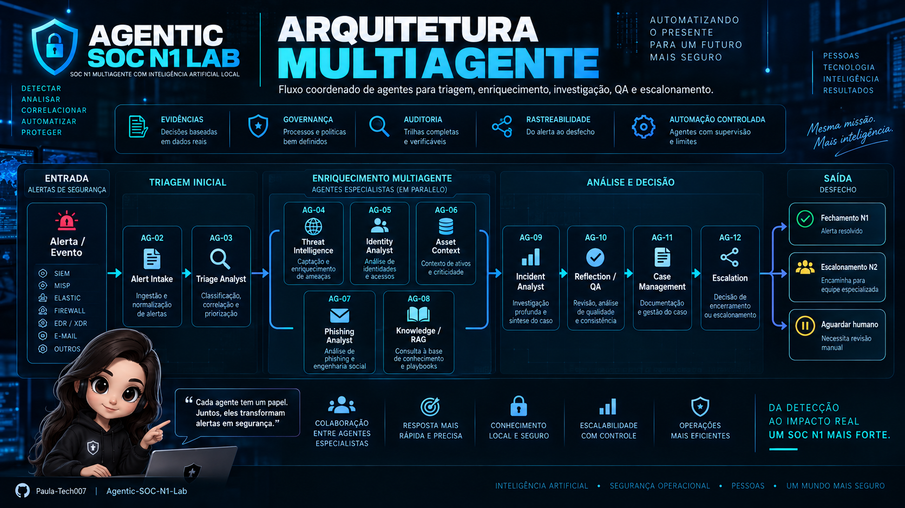
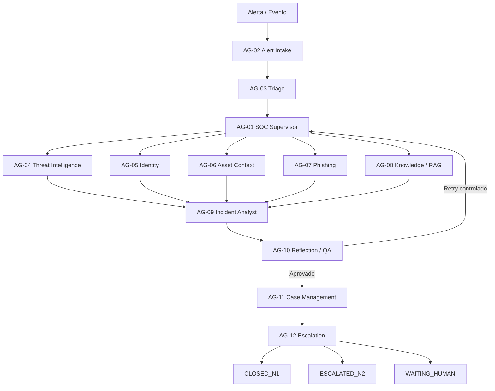
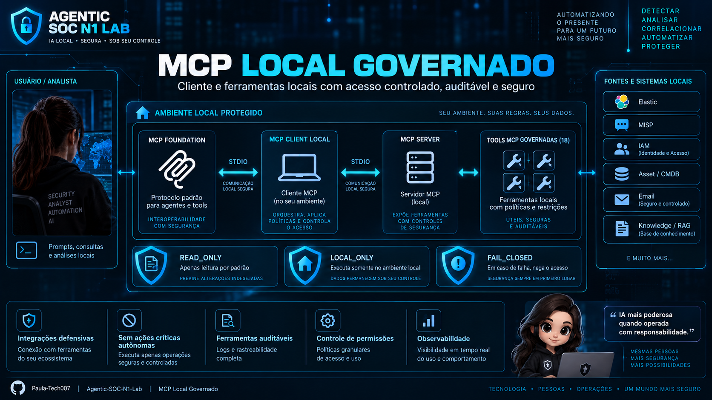
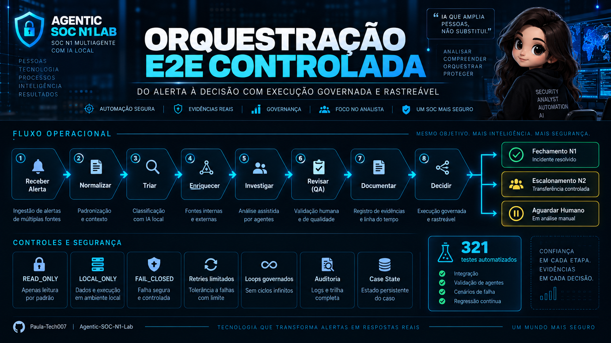

<p align="center">
  
</p>

<h1 align="center">🛡️ Agentic SOC N1 Lab</h1>

<p align="center">
  <strong>SOC N1 Multiagente com Inteligência Artificial Local</strong>
</p>

<p align="center">
  Triagem • Evidências • Governança • RAG • MCP • Orquestração E2E • Escalonamento Humano
</p>

<p align="center">
  
  
  
  
  
  
  
</p>

<p align="center">
  <strong>A LLM interpreta. A ferramenta comprova.</strong>
</p>

---

## ✨ Visão Geral

O **Agentic SOC N1 Lab** é um laboratório de engenharia de segurança voltado à automação defensiva de atividades de **SOC N1** por meio de uma arquitetura multiagente, IA local, ferramentas controladas e decisões orientadas por evidências.

O projeto foi desenhado para automatizar tarefas repetitivas sem entregar autoridade irrestrita à IA.

Conclusões críticas devem ser sustentadas por dados verificáveis, regras determinísticas, auditoria e controles de governança.

### Destaques

| Capacidade | Implementação |
| --- | --- |
| 🤖 Arquitetura multiagente | 12 agentes especializados |
| 🧠 IA local | Ollama |
| 📚 Knowledge / RAG | Local e governado |
| 🔌 MCP | STDIO / LOCAL_ONLY |
| 🛡️ Política das ferramentas | READ_ONLY / FAIL_CLOSED |
| 🧰 Ferramentas MCP | 18 ferramentas defensivas |
| 🔁 Orquestração | Fluxo E2E controlado |
| 🧪 Testes | 321 passed |
| 🚫 Ações críticas autônomas | 0 |
| 👤 Escalonamento humano | Disponível |

---

## 🎯 Objetivo

O laboratório foi projetado para automatizar o ciclo operacional de um SOC N1 de forma controlada:

- receber e normalizar alertas;
- realizar triagem e classificação;
- enriquecer indicadores e contexto;
- consultar Threat Intelligence;
- analisar identidades e privilégios;
- consultar ativos e criticidade;
- investigar phishing;
- recuperar conhecimento por RAG;
- utilizar ferramentas defensivas por MCP;
- correlacionar evidências;
- construir investigações;
- executar Reflection / QA;
- documentar casos;
- decidir fechamento ou escalonamento;
- manter auditoria e rastreabilidade.

---

# 🧠 Arquitetura Multiagente

O projeto possui **12 agentes oficiais**.

<p align="center">
  
</p>

<p align="center">
  <sub><strong>Arquitetura dos agentes especializados e seus papéis no SOC N1.</strong></sub>
</p>

| ID | Agente | Responsabilidade |
| --- | --- | --- |
| **AG-01** | SOC Supervisor Agent | Coordena, roteia e controla a execução |
| **AG-02** | Alert Intake Agent | Recebe, valida e normaliza alertas |
| **AG-03** | Triage Analyst Agent | Classifica severidade, contexto e prioridade |
| **AG-04** | Threat Intelligence Agent | Consulta e consolida inteligência de ameaças |
| **AG-05** | Identity Analyst Agent | Analisa conta, MFA, grupos e privilégios |
| **AG-06** | Asset Context Agent | Recupera ativo, IP, criticidade e EDR |
| **AG-07** | Phishing Analyst Agent | Analisa metadados e autenticação de e-mail |
| **AG-08** | Knowledge / RAG Agent | Recupera conhecimento, políticas e playbooks |
| **AG-09** | Incident Analyst Agent | Consolida evidências e investigação |
| **AG-10** | Reflection / QA Agent | Revisa qualidade, lacunas e inconsistências |
| **AG-11** | Case Management Agent | Mantém documentação e histórico |
| **AG-12** | Escalation Agent | Fecha N1, escala N2 ou aguarda humano |

---

## 🔁 Fluxo Principal



---

## 🔄 Ciclo de Vida do Caso

```text
RECEIVED
   ↓
NORMALIZING
   ↓
TRIAGING
   ↓
ENRICHING
   ↓
INVESTIGATING
   ↓
CORRELATING
   ↓
REVIEWING
   ↓
DOCUMENTING
   ↓
DECIDING
   ↓
CLOSED_N1 / ESCALATED_N2 / WAITING_HUMAN
```

### Estados auxiliares

```text
WAITING_DATA
WAITING_HUMAN
RETRYING
FAILED
CANCELLED
```

### Estados dos agentes

```text
PENDING
RUNNING
COMPLETED
FAILED
SKIPPED
```

---

# 🧩 CaseState

O `CaseState` funciona como a ficha viva da investigação e concentra o contexto operacional do caso.

```text
Alert
  +
IOCs
  +
Identidades
  +
Ativos
  +
Evidências
  +
Triage
  +
Threat Intelligence
  +
Phishing
  +
Knowledge / RAG
  +
Investigation
  +
QA
  +
Escalation
  +
Audit
  +
Workflow
  ↓
CaseState
```

O `CaseState` inclui suporte a:

- `case_id`;
- `correlation_id`;
- alerta original;
- IOCs;
- identidades;
- ativos;
- evidências;
- triagem;
- enriquecimento;
- investigação;
- QA;
- escalonamento;
- auditoria;
- workflow;
- versionamento;
- timestamps;
- serialização;
- persistência.

---

# 🔐 Segurança e Governança

A arquitetura aplica controles defensivos desde a fundação.

| Princípio | Aplicação |
| --- | --- |
| **Deny by default** | Tudo começa bloqueado até autorização explícita |
| **Least privilege** | Cada agente recebe somente o necessário |
| **Fail closed** | Falha de validação resulta em bloqueio |
| **Evidence first** | Evidência precede conclusões críticas |
| **ToolRuntime soberano** | A ferramenta controla execução, não a LLM |
| **READ_ONLY** | Integrações operam sem escrita crítica |
| **Auditoria append-only** | Eventos anteriores não são sobrescritos |
| **Retries / loops limitados** | Evita repetição indefinida |
| **Escalonamento humano** | Humano ou N2 permanece disponível |
| **Sem shell irrestrito** | Execução arbitrária não é permitida |
| **Sem contenção crítica autônoma** | Ações críticas não são executadas automaticamente |

---

# 🧰 Fase 4 — Tools e Integrações

A Fase 4 estabeleceu a infraestrutura de ferramentas defensivas utilizada pelos agentes.

## 4.0 — Fundação de Tools

Componentes principais:

```text
ToolDefinition
ToolRequest
ToolResult
ToolAuthorization
ToolRegistry
ToolRuntime
ToolPolicy
```

### Fluxo

```text
AGENTE
   ↓
ToolRequest
   ↓
Autorização
   ↓
ToolRegistry
   ↓
ToolRuntime
   ↓
Integração
   ↓
ToolResult
   ↓
Evidência
```

---

## 🔗 Integrações Defensivas

| Integração | Ferramentas |
| --- | --- |
| **MISP** | `misp.search_ioc`, `misp.get_event`, `misp.get_attribute` |
| **Elastic** | `elastic.search_alerts`, `elastic.search_events`, `elastic.get_document` |
| **Identity / IAM** | `iam.get_user`, `iam.get_account_status`, `iam.get_mfa_status`, `iam.get_group_membership` |
| **Asset / CMDB** | `asset.get_asset`, `asset.get_ip_context`, `asset.get_criticality`, `asset.get_edr_status` |
| **Email / Phishing** | `email.get_message_metadata`, `email.get_headers`, `email.get_authentication_results`, `email.get_attachment_metadata` |

---

## ⛔ Ações Críticas Bloqueadas

Exemplos de ações que não podem ser executadas automaticamente:

```text
iam.reset_password
iam.disable_user
iam.delete_user

network.block_ip
network.unblock_ip

firewall.add_rule
firewall.delete_rule
firewall.modify_rule

endpoint.isolate_host
endpoint.kill_process
endpoint.delete_file

email.open_url
email.execute_attachment
email.download_attachment
```

Quando necessário, uma ação crítica pode existir apenas como:

```text
RECOMMENDED_ACTION
```

ou:

```text
SIMULATED_ACTION
```

---

# 📚 Fase 5 — Knowledge / RAG Local

A Fase 5 implementou a recuperação local de conhecimento autorizado.

## Pipeline

```text
knowledge/
   ↓
Ingestão segura
   ↓
Chunking
   ↓
Embeddings locais
   ↓
Índice vetorial JSON
   ↓
Cosine Similarity
   ↓
Top-K
   ↓
RAGSearchResult
   ↓
RAGKnowledgeAdapter
   ↓
AG-08 Knowledge / RAG
```

### Etapas da Fase 5

| Etapa | Função | Status |
| --- | --- | :---: |
| **5.0** | Configuração e contratos | ✅ |
| **5.1** | Ingestão segura | ✅ |
| **5.2** | Chunking | ✅ |
| **5.3** | Embeddings locais | ✅ |
| **5.4** | Índice vetorial JSON | ✅ |
| **5.5** | Retrieval / Similaridade | ✅ |
| **5.6** | Integração RAG → AG-08 | ✅ |
| **5.7** | Testes formais | ✅ |

### Guardrails do RAG

O pipeline inclui bloqueio de:

- path traversal;
- links simbólicos;
- arquivos vazios;
- arquivos excessivamente grandes;
- conteúdo fora de UTF-8;
- execução de arquivos.

---

# 🔌 Fase 6 — MCP

A Fase 6 introduziu a camada **MCP — Model Context Protocol** de forma local, defensiva e governada.

<p align="center">
  
</p>

<p align="center">
  <sub><strong>MCP local e governado, integrado ao ToolRuntime e às políticas de segurança.</strong></sub>
</p>

O SDK oficial utiliza o namespace:

```text
mcp
```

A implementação própria do projeto utiliza:

```text
soc_mcp
```

Essa separação evita colisão de namespace entre o SDK oficial e o código do laboratório.

---

## 6.0 — Fundação MCP Read-Only

Implementado:

- SDK MCP **2.2.0**;
- namespace próprio `soc_mcp`;
- contratos MCP;
- configuração MCP;
- registry MCP derivado do catálogo central;
- servidor local;
- bridge `MCP → ToolRuntime`;
- transporte `STDIO`;
- execução `LOCAL_ONLY`;
- política `READ_ONLY`;
- comportamento `FAIL_CLOSED`;
- bloqueio de transporte de rede;
- bloqueio de ações críticas;
- 18 ferramentas defensivas governadas.

### Fluxo MCP

```text
AGENTE
   ↓
MCP Client
   ↓
MCP Server
   ↓
MCP Bridge
   ↓
ToolRuntime
   ↓
ToolPolicy / Permissions
   ↓
ToolResult
   ↓
Evidence
```

---

## 6.1 — MCP Client Local Controlado

O cliente MCP:

- conecta somente ao servidor local;
- lista somente ferramentas publicadas e autorizadas;
- rejeita ferramentas não publicadas;
- executa apenas operações defensivas/read-only;
- não controla livremente `agent_id`;
- não controla livremente `case_id`;
- não controla livremente `correlation_id`;
- respeita o contexto definido pelo servidor;
- encerra a sessão de forma controlada.

---

# 🔁 Fase 7 — SOC Multiagente Ponta a Ponta

A Fase 7 integrou os componentes em um workflow **E2E auditável e governado**.

<p align="center">
  
</p>

<p align="center">
  <sub><strong>Orquestração ponta a ponta do alerta até a decisão final do SOC N1.</strong></sub>
</p>

### Entregas da Fase 7

| Etapa | Entrega | Status |
| --- | --- | :---: |
| **7.1** | Fundação E2E controlada | ✅ |
| **7.2** | Supervisor automático | ✅ |
| **7.3** | Enriquecimento AG-04 → AG-08 | ✅ |
| **7.4** | Incident Analyst | ✅ |
| **7.5** | Reflection / QA + retry controlado | ✅ |
| **7.6** | Case Management | ✅ |
| **7.7** | Escalation / finalização | ✅ |
| **7.8** | `Phase7E2ERunner` | ✅ |

---

## Fluxo E2E

```text
Alerta
   ↓
AG-02 Alert Intake
   ↓
AG-03 Triage
   ↓
AG-01 Supervisor
   ↓
AG-04 / AG-05 / AG-06 / AG-07 / AG-08
   ↓
AG-09 Incident Analyst
   ↓
AG-10 Reflection / QA
   ↓
Retry controlado quando necessário
   ↓
AG-11 Case Management
   ↓
AG-12 Escalation
   ↓
CLOSED_N1 / ESCALATED_N2 / WAITING_HUMAN
```

---

# 🔍 Modelo de Evidências

Toda conclusão deve possuir rastreabilidade.

### Fontes possíveis

```text
Alertas
IOCs
MISP
Elastic
IAM
Asset / CMDB
Email
RAG
Investigation
Tools
MCP
Audit
```

### Fluxo conceitual

```text
Informação observada
        ↓
     Evidência
        ↓
       Achado
        ↓
   Investigação
        ↓
 Reflection / QA
        ↓
      Decisão
```

---

# 🧾 Auditoria e Persistência

A arquitetura utiliza eventos de auditoria **append-only**.

### Eventos principais

```text
CASE_CREATED
CASE_UPDATED
AGENT_STARTED
AGENT_COMPLETED
TOOL_CALLED
EVIDENCE_ADDED
QA_REVIEWED
DECISION_CREATED
ERROR
HUMAN_ACTION
```

### Persistência

```text
storage/incidents/
storage/database/agentic_soc.db
```

### Estruturas principais

```text
cases
audit_events
```

Arquivos operacionais não são versionados no Git.

---

# 🤖 Inteligência Artificial Local

| Função | Modelo |
| --- | --- |
| LLM / agentes | `qwen3:4b-instruct` |
| Embeddings / RAG | `embeddinggemma` |

### Benefícios

- execução local;
- maior controle sobre dados;
- experimentação com modelos abertos;
- menor dependência de APIs externas;
- separação entre interpretação e comprovação.

---

# ⚙️ Tecnologias

| Tecnologia | Uso |
| --- | --- |
| Python 3.14 | Desenvolvimento principal |
| Pydantic v2 | Schemas e validação |
| Ollama | IA local |
| Qwen3 | LLM |
| EmbeddingGemma | Embeddings |
| NumPy | Operações numéricas |
| HTTPX | Clientes HTTP |
| MCP SDK 2.2.0 | Integração governada de ferramentas |
| SQLite | Persistência |
| Pytest | Testes automatizados |
| Git | Versionamento |
| GitHub | Repositório |
| Mermaid | Diagramas |

---

# 🧪 Testes Automatizados

O projeto possui atualmente:

```text
321 testes aprovados
```

### Distribuição dos testes

| Módulo | Testes | Status |
| --- | ---: | :---: |
| Fundação | 8 | ✅ |
| Fase 2 | 20 | ✅ |
| Fase 3 | 19 | ✅ |
| Fase 4.0 — Tools | 20 | ✅ |
| Fase 4.1 — MISP | 17 | ✅ |
| Fase 4.2 — Elastic | 19 | ✅ |
| Fase 4.3 — Identity / IAM | 24 | ✅ |
| Fase 4.4 — Asset / CMDB | 24 | ✅ |
| Fase 4.5 — Email / Phishing | 24 | ✅ |
| Fase 5 — Knowledge / RAG | 30 | ✅ |
| Fase 6 — MCP | 45 | ✅ |
| Fase 7 — E2E | 71 | ✅ |
| **TOTAL** | **321** | ✅ |

### Executar

```powershell
python -m pytest -q
```

Resultado esperado:

```text
321 passed
```

---

# 📂 Estrutura Principal

```text
Agentic-SOC-N1-Lab/
│
├── agents/
│
├── assets/
│   ├── Arquitetura.png
│   ├── MCP.png
│   ├── Orquestracao.png
│   └── banner-agentic-soc-n1-lab.png
│
├── core/
│   ├── config/
│   ├── llm/
│   ├── orchestrator/
│   ├── permissions/
│   ├── schemas/
│   └── state/
│
├── docs/
│
├── knowledge/
│
├── rag/
│
├── soc_mcp/
│   ├── client/
│   └── server/
│
├── simulations/
│
├── storage/
│
├── tests/
│
├── tools/
│
├── main.py
├── requirements.txt
└── README.md
```

---

# 🗺️ Roadmap

| Fase | Escopo | Status |
| :---: | --- | :---: |
| **0** | Escopo, arquitetura e governança | ✅ Concluída |
| **1** | Fundação técnica | ✅ Concluída |
| **2** | Schemas, estado, persistência e auditoria | ✅ Concluída |
| **3** | Agentes, runtime e orquestração | ✅ Concluída |
| **4** | Tools e integrações defensivas | ✅ Concluída |
| **5** | Knowledge / RAG local | ✅ Concluída |
| **6** | MCP local, read-only e governado | ✅ Concluída |
| **7** | SOC multiagente ponta a ponta | ✅ Concluída |

**Roadmap principal 0–7 concluído.**

O projeto continua evoluindo no **mesmo repositório**, preservando arquitetura, governança e histórico.

---

# 🚀 Executando o Projeto

## 1. Clonar o repositório

```powershell
git clone https://github.com/Paula-Tech007/Agentic-SOC-N1-Lab.git
cd Agentic-SOC-N1-Lab
```

## 2. Criar o ambiente virtual

```powershell
python -m venv .venv
```

## 3. Ativar o ambiente virtual

```powershell
.\.venv\Scripts\Activate.ps1
```

## 4. Instalar as dependências

```powershell
python -m pip install -r requirements.txt
```

## 5. Executar os testes

```powershell
python -m pytest -q
```

### Resultado atual

```text
321 passed
```

---

# ⚠️ Uso Defensivo

Este repositório é um laboratório educacional e defensivo de Segurança Cibernética.

Foi desenvolvido para:

- pesquisa defensiva;
- laboratórios SOC;
- automação de segurança;
- arquitetura de agentes;
- Inteligência Artificial aplicada à segurança;
- simulações controladas.

O projeto não representa autorização para executar ações críticas automaticamente em ambientes reais.

---

# 👩‍💻 Autora

**Paula Sabino**

Segurança Cibernética • SOC • Automação de Segurança • IA aplicada à Segurança

---

<p align="center">
  <strong>🛡️ Agentic SOC N1 Lab</strong>
</p>

<p align="center">
  Construindo um SOC multiagente auditável, governado e orientado por evidências.
</p>